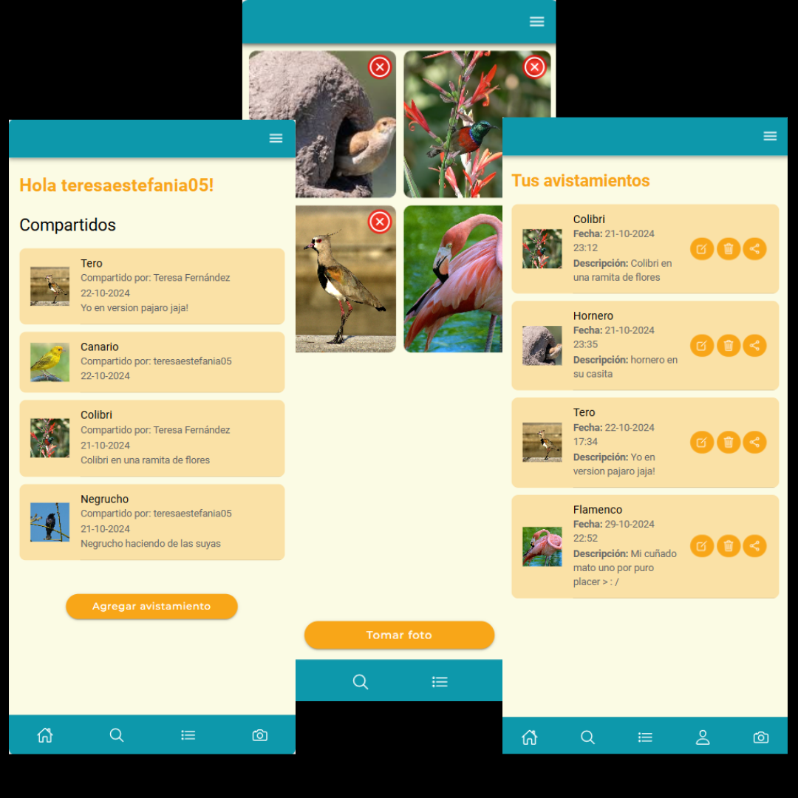

  

# AVES A VER

## Descripción

**Aves a Ver** es una aplicación diseñada para ornitólogos y aficionados a las aves que desean registrar sus avistamientos de manera sencilla y efectiva. Con una interfaz fácil de usar e intuitiva.

## Funcionalidades
+ inicio de sesión por cuenta propia o cuenta Google 
+ Registrar avistamiento
+ Listar avistamientos
+ Buscar avistamientos registrados en el mundo
+ Galería de imágenes 
+ cámara fotográfica 
+ Compartir registros con otros usuarios de la aplicación 

## Tecnologias y herramientas utilizadas para el desarrollo

+ **Ionic y Angular:** para el desarrollo de la aplicación móvil.
+ **TypeScript:** para escribir el código de la lógica.
+ **API de eBird:** para adquirir la informacion sobre los avistamietos registrados en diferentes partes del mundo.
+ **Capacitor:** para acceder a la cámara del dispositivo

